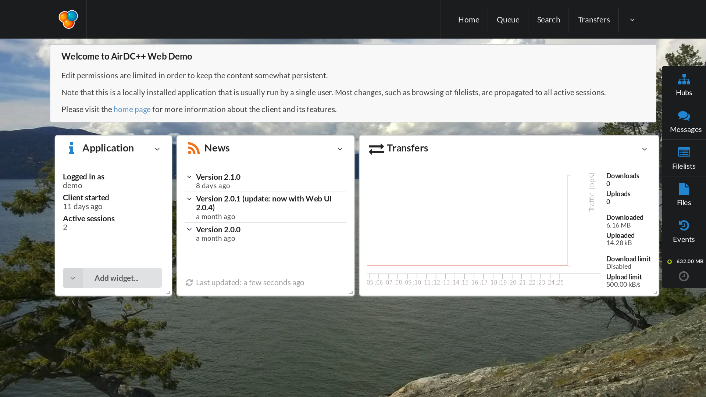
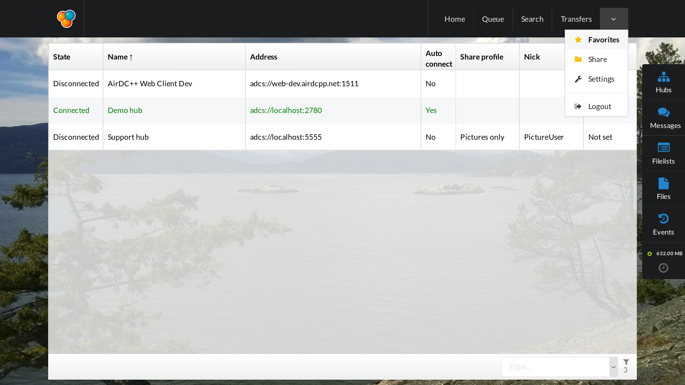

# Airdc++w Screenshots

## Home page

 - "Queue" is where we can see what's downloading
 - "Search" is where we can search some terms on people's share connected on the same hubs we are
 - "Transfers" is where we can see the current downloading fragments
 - "Hubs" is where we can see chatroom and users' listing of each hub
 - "Messages" is where we can send private messages (sometimes encrypted)
 - "Filelists" is where we can see filelists of connected users
 - "Files" is where we can directly watch text files, sound files or some pictures
 - "Events" is where we see error/warning/information logs
 
 Then we have the total size of downloading queue, sometimes the hash speed, and even the upload/download speed!
 
 ## Menu
 

 - "Favorites" is the best place to add a hub setting. The other way (from "hubs") is the really-quick-way-without-possible-advanced-configuration. In this place, you can personnalize for each hub settings like username, password, profile share, and autoconnect.
 - "Share" is where you'll add and modify what folders you share. You can also set on which profile you can see theses share folders.
 - "Settings" is where you manage your AirDC++ Web Client instance (by example: the number of hash thread; if the hash thread should run automatically or not; the minimum and maximun value of the upload/download speed; etc)
 - "Logout" is the to disconnect you from your AirDC++ Web Client instance. It won't stop your AirDC++ Web Client running as a background process. If you want stopping AirDC++ Web Client (and its background process), you should go to Home; click on the back arrow of the widget application, and select "Shut down application".
