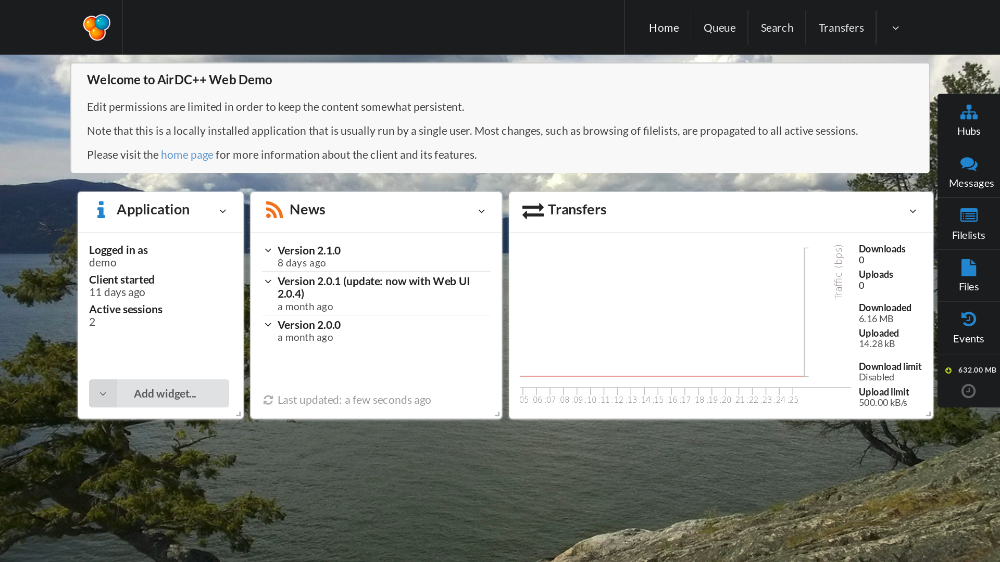
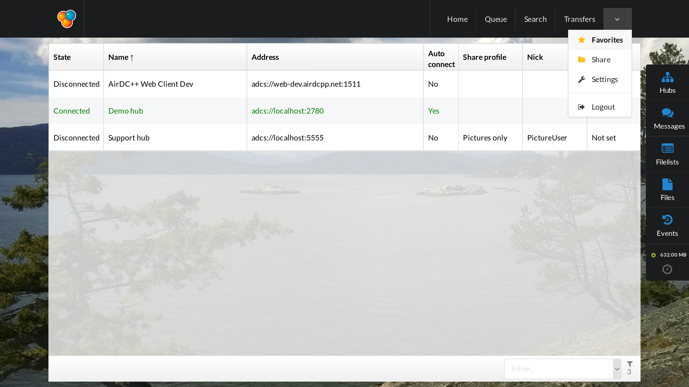

# Airdc++w Screenshots

## Home page

 - "Queue" is where we can see what's downloading
 - "Search" is where we can search some terms on share where hubs are connected
 - "Transfers" is where we can see the current downloading fragments
 - "Hubs" is where we can see chatroom and user listing of each hub
 - "Messages" is where we can send private message (sometimes encrypted)
 - "Filelists" is where we can see filelists of connected user
 - "Files" is where we can directly watch text file, sound file or some pictures
 - "Events" is where we see error/warning/information log
 
 Then we have the total size of downloading queue, sometimes the hash speed, upload/download speed too
 
 ## Menu
 

 - "Favorites" is the best place to add a hub setting. The other way (from "hubs") is the really-quick-way-without-possible-advanced-configuration. in this place, you can personnalize for each hubs settings like username, password, profile share, autoconnect.
 - "Share" is where you'll add/modify the share. You can also set on which profile you can see this share.
 - "Settings" is where you manage your aircpp instance (by setting hash thread, min and max of upload/download, etc)
 - "Logout" is to disconnect you. It won't stop airdcpp. If you want stop airdcpp, go to Home > wirdget application > Shutdown application
