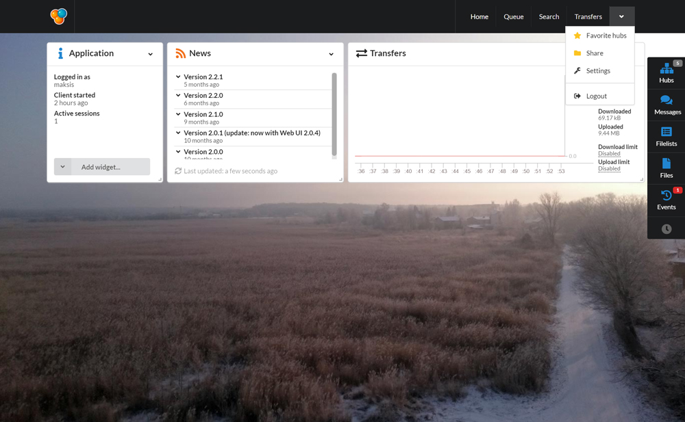

# User interface

## Main navigation

 - *Home* - customizable widget layout
 - *Queue* - listing of pending/active/finished items that are being downloaded on disk
 - *Search* - search files/directories from all users that are currently connected to the same hubs
 - *Transfers* - listing of individual download/upload connections

##### Dropdown menu

 - *Favorite hubs* - save hubs with possible custom settings (username, password, share profile etc.)
 - *Share* - add and edit directories that are being shared to other users
 - *Settings* - edit/view application/UI settings
 - *Logout* - disconnect the current browser session (the application itself won't be stopped)

## Sidebar

 - *Hubs* - listing of open hub sessions (chat and userlist of each open hub) and 
 - *Messages* - listing of private messages
 - *Filelists* - listing of open users' filelist
 - *Files* - listing of files that are currently open (text/sound/picture/video files)
 - *Events* - listing of information/warning/error messages

##### Speed/size indicators

- Total size of download queue
- Hash speed
- Upload/download speed

*Only items with non-zero values are being displayed*

##### Toggler icons

- Away state indicator/toggler
